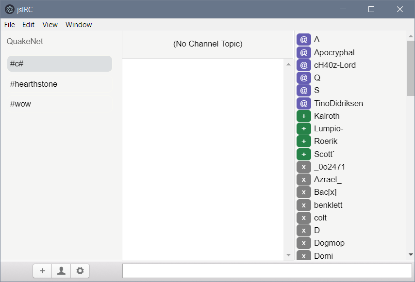

# jsIRC

jsIRC is two things at the momenet. A JavaScript port of the IRC.NET library; and a UI client built-on the port.

The framework part is a fully functional IRC library in JavaScript (ES6) built with Node.JS

The UI is work-in-progress.

# UI

